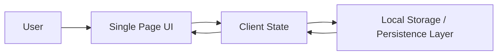
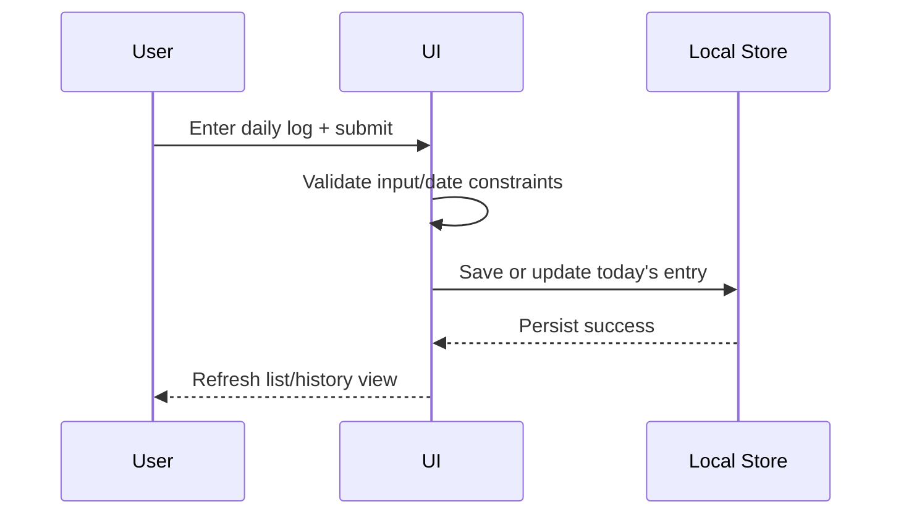
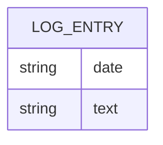

# DailyLogs

> A single-page website where I write one short log per day and see my past logs.

[](https://github.com/RishavJbn/DailyLogs)
[](https://github.com/RishavJbn/DailyLogs)
[](https://github.com/RishavJbn/DailyLogs)
[](https://github.com/RishavJbn/DailyLogs)


<!-- Optional: Replace with real image -->
<!--  -->

**Quick Links:** [Live Demo](#-deployment) · [Documentation](#table-of-contents) · [Report Bug](https://github.com/RishavJbn/DailyLogs/issues) · [Request Feature](https://github.com/RishavJbn/DailyLogs/issues)

---

## Table of Contents

- [About the Project](#about-the-project)
- [Tech Stack](#tech-stack)
- [Prerequisites](#prerequisites)
- [Local Installation (Step-by-Step)](#local-installation-step-by-step)
- [Project Structure](#project-structure)
- [Core Logic / How It Works](#core-logic--how-it-works)
- [API Documentation](#api-documentation)
- [Database Schema](#database-schema)
- [Environment Variables Reference](#environment-variables-reference)
- [Scripts Reference](#scripts-reference)
- [Testing](#testing)
- [Deployment](#deployment)
- [Folder-Level Configuration (Docker, if applicable)](#folder-level-configuration-docker-if-applicable)
- [Contributing Guidelines](#contributing-guidelines)
- [Roadmap](#roadmap)
- [FAQ / Troubleshooting](#faq--troubleshooting)
- [License](#license)
- [Contact / Acknowledgements](#contact--acknowledgements)

---

## About the Project

DailyLogs is a lightweight, single-page journaling app designed for writing one short note per day and reviewing previous entries in a clean timeline-like experience.

### Motivation

Many journaling apps are either too complex or require account setup and heavy workflows. DailyLogs focuses on speed and consistency: open the app, write your log, and keep going.

### Key Features

- ✍️ Write one short daily log
- 📅 View historical logs
- ⚡ Simple single-page UX
- 🧠 Minimal friction and focused design

### Screenshots / GIFs

> Add real visuals once available.

- `docs/assets/home.png` — main dashboard
- `docs/assets/new-log.gif` — quick create flow
- `docs/assets/history.png` — previous logs view

### Architecture Overview



> **Current note:** Based on available context, this appears to be a frontend-focused SPA. If a backend exists, update architecture and API sections accordingly.

---

## Tech Stack

| Category | Technology | Purpose |
|---|---|---|
| Frontend | JavaScript | App logic and interactions |
| Styling | CSS | Layout and visual styling |
| Markup | HTML | Page structure |
| Hosting (suggested) | GitHub Pages / Netlify / Vercel | Static site deployment |

---

## Prerequisites

> Since dependency and runtime files were not provided, use this baseline setup.

- **Git**: latest stable
- **Node.js**: `>= 18` (recommended if build tooling exists)
- **npm**: `>= 9` (if `package.json` is present)
- Modern browser: Chrome / Firefox / Edge latest versions

### External Accounts / API Keys

- None confirmed from provided data.

---

## Local Installation (Step-by-Step)

### 1) Clone the repository

```bash
git clone https://github.com/RishavJbn/DailyLogs.git
cd DailyLogs
```

### 2) Install dependencies

If a `package.json` exists:

```bash
npm install
```

If this is plain static HTML/CSS/JS (no package manager), skip this step.

### 3) Environment variable setup

No `.env.example` was provided. If your project later requires environment variables, create `.env` and document them as below.

| Variable | Description | Example | Required |
|---|---|---|---|
| `PORT` | Local dev server port | `3000` | Optional |

### 4) Database setup / migrations

- No database setup info was provided.
- If logs are stored in browser storage, no migration is required.

### 5) Run in development mode

If npm scripts exist:

```bash
npm run dev
```

If no scripts exist, use a static server:

```bash
npx serve .
```

### 6) Build for production

If applicable:

```bash
npm run build
```

### 7) Run tests

If test scripts/framework are configured:

```bash
npm test
```

### 8) Default local URL/port

- Typical URL: `http://localhost:3000` or tool-assigned port.

### 9) Troubleshooting

- **Port already in use**  
  Change port:
  ```bash
  PORT=3001 npm run dev
  ```
- **`npm ERR! missing script`**  
  Check `package.json` scripts section and use available script names.
- **Blank page after launch**  
  Open browser console and inspect asset path errors.

---

## Project Structure

> Replace with actual structure from your repository for full accuracy.

```text
DailyLogs/
├─ index.html
├─ styles.css
├─ script.js
├─ assets/
│  └─ (images/icons)
└─ README.md
```

### Structure Notes

- `index.html` — root SPA markup
- `styles.css` — styling rules
- `script.js` — core app behavior and state handling
- `assets/` — static files (icons/images)

---

## Core Logic / How It Works

At a high level, DailyLogs centers around one action: **capture a short log for the current date**, then render historical entries for review.

1. User opens the page.
2. App loads previously saved logs (likely from local persistence).
3. User submits today’s short log.
4. App validates and stores it.
5. UI re-renders list/history.

### Design Decisions (expected for this app type)

- **SPA architecture** for fast, simple usage.
- **Client-side persistence** for zero backend setup.
- **Minimal form surface area** to encourage daily consistency.

### Sequence Diagram (Create Daily Log)



---

## API Documentation

No API routes were provided, and this project appears to be frontend-first/static.

<details>
<summary><strong>If you add an API later, use this template</strong></summary>

### Base URL

```text
http://localhost:3000/api
```

### Authentication

```http
Authorization: Bearer <token>
```

### Example Route Spec

| Method | Endpoint | Description | Auth |
|---|---|---|---|
| `GET` | `/logs` | Fetch all logs | No |
| `POST` | `/logs` | Create/update daily log | Yes/No |

</details>

---

## Database Schema

No backend database schema was provided.

### Likely Client-Side Data Shape (if using local storage)

```json
{
  "logs": [
    {
      "date": "2026-07-16",
      "text": "Worked on README improvements."
    }
  ]
}
```



---

## Environment Variables Reference

No confirmed environment variables yet.

| Variable | Purpose | Example | Required | Where to get it |
|---|---|---|---|---|
| `PORT` | Dev server port | `3000` | Optional | Local choice |

---

## Scripts Reference

> Script list could not be verified without `package.json`.

| Script | Purpose |
|---|---|
| `npm run dev` | Start development server (if configured) |
| `npm run build` | Build production bundle (if configured) |
| `npm test` | Run tests (if configured) |
| `npm run lint` | Run linter (if configured) |

---

## Testing

No test framework details were provided.

### Recommended baseline

- Unit tests: **Vitest** or **Jest**
- E2E tests: **Playwright** or **Cypress**

### Typical commands

```bash
npm test
npm run test:watch
npm run coverage
```

---

## Deployment

Because this appears to be a static SPA, deployment is straightforward.

### Option A: GitHub Pages

1. Push code to `main` branch.
2. Go to **Settings → Pages**.
3. Select source branch/folder.
4. Save and wait for deployment URL.

### Option B: Netlify / Vercel

1. Import `RishavJbn/DailyLogs`.
2. Build command: *(if needed)* `npm run build`
3. Output directory: *(if needed)* `dist` or project root
4. Add production env vars if introduced later.

### CI/CD

- Not confirmed from provided context.
- Add GitHub Actions workflow if desired.

---

## Folder-Level Configuration (Docker, if applicable)

No Docker configuration was provided.

If needed later:

- Add `Dockerfile`
- Optionally add `docker-compose.yml` for local reproducibility

---

## Contributing Guidelines

1. Fork the repository.
2. Create a feature branch:
   ```bash
   git checkout -b feat/short-description
   ```
3. Commit using conventional commits:
   ```bash
   git commit -m "feat: add daily log validation"
   ```
4. Push and open a Pull Request.

### Code Style

- Keep JavaScript modular and readable.
- Prefer small functions with clear names.
- Run lint/tests before PR submission (once configured).

---

## Roadmap

- [ ] Add edit/delete for existing logs
- [ ] Add search/filter by date/text
- [ ] Add export logs (JSON/Markdown)
- [ ] Add optional cloud sync
- [ ] Add dark/light theme toggle
- [ ] Add automated tests and coverage badges

---

## FAQ / Troubleshooting

**Q: Where are logs stored?**  
A: Likely in browser storage (based on app type). Confirm in `script.js`.

**Q: Can I use this on mobile?**  
A: Yes, if responsive styles are implemented.

**Q: I don’t see npm scripts working.**  
A: This may be a pure static project; run with a static server instead.

---

## License

No license file was specified in the provided context.

> Add a `LICENSE` file (e.g., MIT) and update this section:
>
> `Distributed under the MIT License. See LICENSE for more information.`

---

## Contact / Acknowledgements

**Maintainer:** [@RishavJbn](https://github.com/RishavJbn)  
**Repository:** https://github.com/RishavJbn/DailyLogs

### Acknowledgements

- GitHub for hosting and collaboration
- Open-source web ecosystem (HTML/CSS/JavaScript community)
